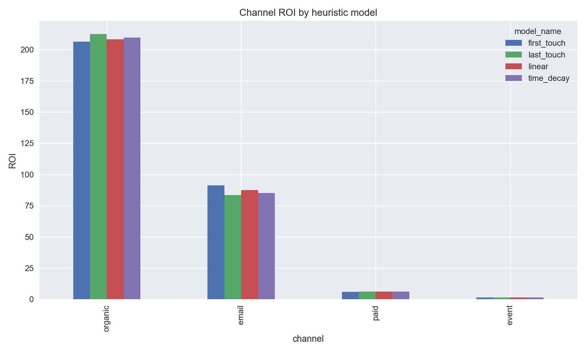
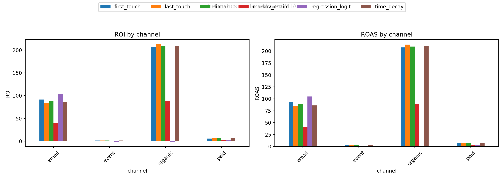
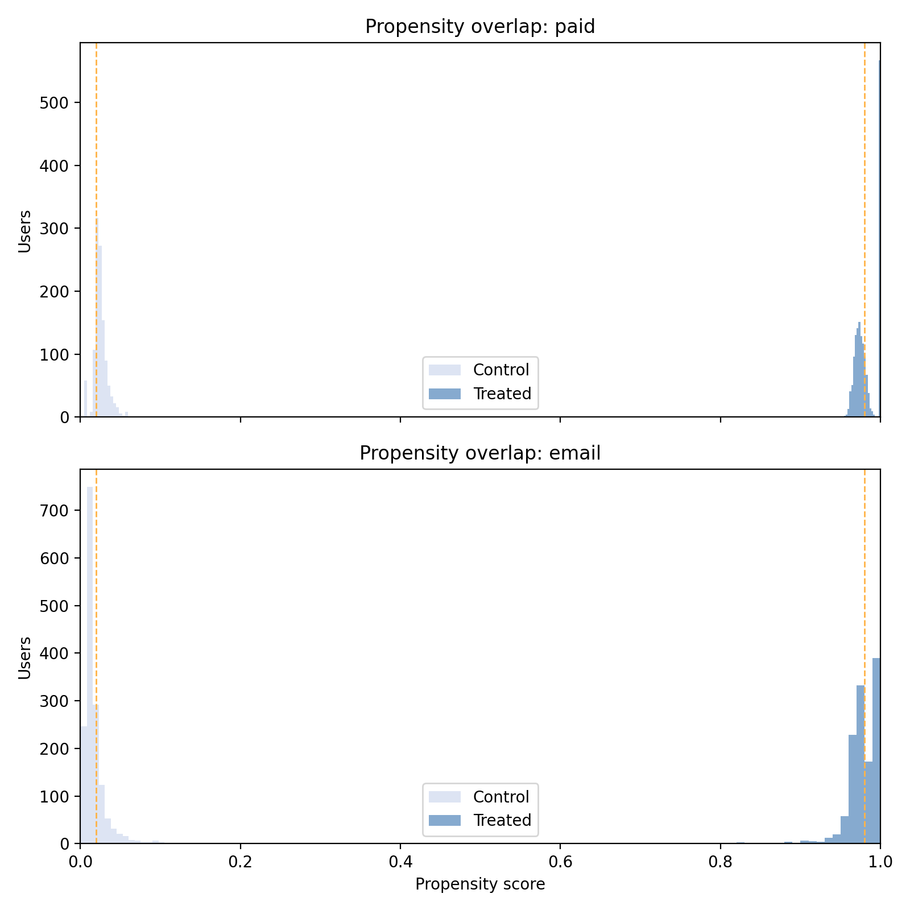
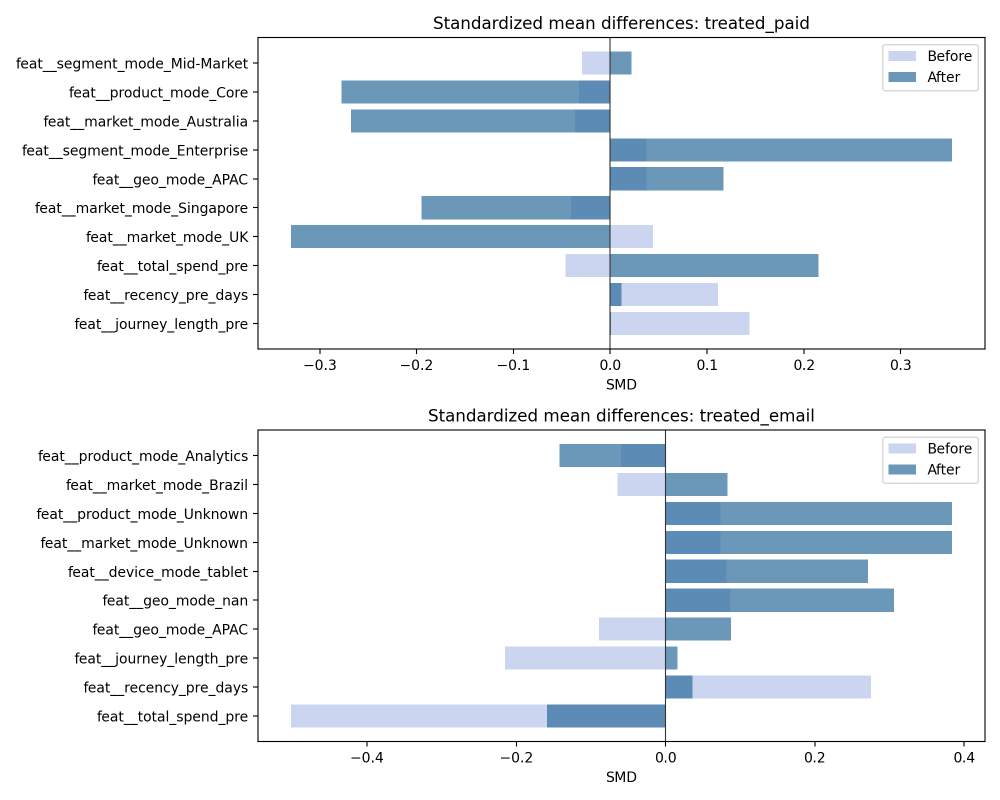

# Multi-Channel Marketing Attribution & ROI Framework

[](https://github.com/Rohit-Somisetty/multi-channel-marketing-attribution-roi/actions/workflows/ci.yml)

[](LICENSE)

## Business Problem
Modern growth teams must quantify how paid media, lifecycle email, organic content, and in-person events contribute to pipeline, revenue, and customer lifetime value. Budgets are tightening, so we need a repeatable framework that reveals how combinations of touches influence conversions, surfaces incremental lift, and pinpoints channels that destroy or create ROI. This project delivers a reproducible toolkit that ingests raw touchpoints, aligns them to conversions, and produces stakeholder-ready attribution and ROI insights.

## Data Schema
- **Touchpoints**: `user_id`, timestamp, channel, campaign, touch type (impression/click/open/attend), spend, device, geo, segment.
- **Conversions**: `user_id`, conversion timestamp, conversion value, product, market.
- **Journey Logic**: multi-touch sequences spanning 2–8 events, 30-day attribution window, explicit cost tracking for channel/campaign ROI.

## Modeling Roadmap
1. **Heuristic Attribution Baseline**: rule-based last-touch, first-touch, linear, and time-decay approaches to produce fast insights.
2. **Data-Driven Multi-Touch Attribution (MTA)**: probabilistic methods (e.g., Markov chain removal effects) or regularized logistic models to estimate marginal channel weights.
3. **Incrementality & ROI Measurement**: causal inference on observational data (propensity scoring, matched comparisons, uplift modeling) to estimate incremental lift and ROI deltas under new spend scenarios.

## KPIs & Decision Outputs
- **ROI by Channel/Campaign**: `(Incremental Revenue - Spend) / Spend`.
- **Cost per Acquisition (CPA)** and **Customer Acquisition Cost (CAC)** segmented by audience and market.
- **Incremental Lift**: difference between observed conversions and counterfactual estimate without channel exposure.
- **Budget Reallocation Guidance**: ranked opportunities based on marginal ROI and incremental lift at the edge.

## Quickstart

```bash
pip install -r requirements.txt -r requirements-dev.txt
python scripts/run_all.py        # set FAST=1 for quick CI-sized runs
streamlit run dashboards/app.py
```

## Key Outputs

| Artifact | Description |
| --- | --- |
| `data/attribution_channel_metrics.csv` | Heuristic ROI & ROAS by channel across first/last/linear/time-decay models |
| `data/attribution_markov_channel_metrics.csv` | Markov removal-channel contributions and diagnostics |
| `data/incremental_roi_summary.csv` | Incremental ROI/ROAS deltas from PSM/IPW/AIPW causal estimators |
| `reports/figures/propensity_overlap.png` | Propensity overlap QA for incrementality |
| `reports/figures/mta_model_comparison.png` | Side-by-side heuristics vs. data-driven MTA performance |




## Incrementality
Step 4 layers on observational causal inference: we build a user-level pre/post panel, estimate propensities for paid and email exposure, and run matching plus IPW/AIPW weighting to translate lift into incremental ROI/ROAS with diagnostics marketing leaders can trust.

**Run it**

```bash
python scripts/run_incrementality.py
```

**Key outputs**
- `data/incremental_roi_summary.csv`: causal ROI + ROAS deltas for paid/email under PSM, IPW, and AIPW methods.
- `reports/figures/propensity_overlap.png`: overlap diagnostic confirming trimmed propensity support.
- `reports/figures/psm_balance_plot.png`: before/after standardized mean differences for top covariates.



